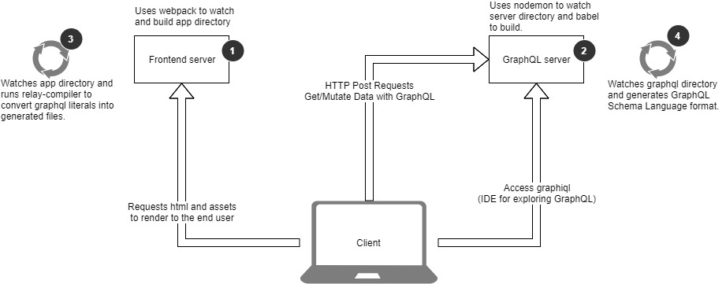

Workflow Architecture
-----------------

# Development Workflow architecture
Getting GraphQL to work with relay needs specific handling that might get complicated and difficult to maintain if not handled correctly.

Here's a virtualization of how the development workflow works

In this figure you can see there are four components to make the development workflow run smoothly:
1. **Frontend server** This uses webpack to watch and build `/app` directory, You can run this server with `npm run serve:app`.
2. **GraphQL server** This uses babel to build `/server` directory and nodemon to watch for changes, You can run this server with `npm run serve:graphql`.
3. **Frontend watcher** This watches files inside `/app` and run [RelayCompiler](https://facebook.github.io/relay/docs/relay-compiler.html), You can run this watcher with `npm run watcher:app`.
4. **GraphQL watcher** This watches files inside `/server/graphql` and converts our graphql schema to Schema Language format. You can run this watcher with `npm run watcher:graphql`.

It's sometimes best to run these 4 commands separately to be able to distinguish debugging messages and errors. But for simplicity there are two helper scripts:
- `npm run start:app` which runs `npm run serve:app` && `npm run watcher:app` [concurrently](https://github.com/kimmobrunfeldt/concurrently).
- `npm run start:graphql` which runs `npm run serve:graphql` && `npm run watcher:graphql` [concurrently](https://github.com/kimmobrunfeldt/concurrently).

